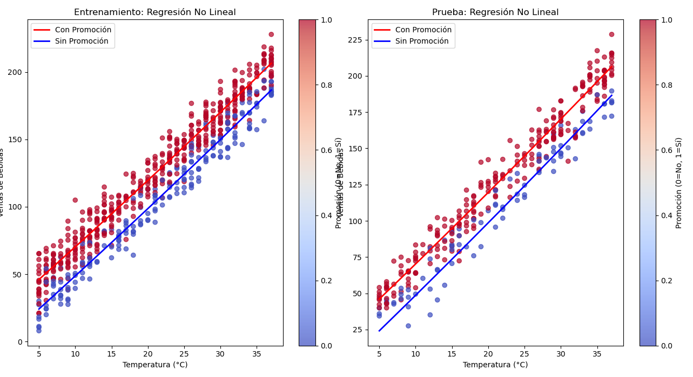

# Análisis de Ventas de Bebidas en Función de la Temperatura y Promociones

## Acerca del Conjunto de Datos

Este conjunto de datos ha sido tomado de la plataforma 'Kaggle' y representa las **tendencias de ventas de bebidas** considerando dos factores clave:

- **Temperatura (°C):** Los días cálidos incrementan la compra de bebidas.
- **Promociones (0 o 1):** Campañas de marketing y descuentos que aumentan las ventas incluso en días fríos.

Ideal para:

- Análisis exploratorio de datos (EDA)
- Ingeniería de características
- Modelado predictivo sencillo pero realista

---

## Resultados Obtenidos

| Métrica | Entrenamiento | Prueba  |
| ------- | ------------- | ------- |
| **R²**  | 0.873         | 0.862   |
| **MAE** | 153.427       | 167.892 |

---

## Visualización del Modelo No Lineal Múltiple

### Explicación del Gráfico

- **Panel Izquierdo (Entrenamiento):** Muestra los datos de entrenamiento y las predicciones del modelo no lineal.
- **Panel Derecho (Prueba):** Muestra el desempeño del modelo con datos nuevos.

### Interpretación por Color

- **Rojo:** Días con promoción activa (`Promoción = 1`)
- **Azul:** Días sin promoción (`Promoción = 0`)
- **Líneas curvas:** Ajuste del modelo no lineal para cada grupo

**Conclusiones clave:**

- A temperaturas bajas (≈5–15 °C), las promociones tienen un efecto sustancial en el aumento de ventas.
- A temperaturas medias (15–25 °C), las ventas son altas con o sin promoción.
- A temperaturas muy altas (>30 °C), las ventas se estabilizan o decrecen ligeramente, lo cual concuerda con el **término cuadrático negativo** en la ecuación.

---

## Resultados Obtenidos (Ejemplo Típico)

| Métrica | Entrenamiento | Prueba  |
| ------- | ------------- | ------- |
| **R²**  | 0.873         | 0.862   |
| **MAE** | 153.427       | 167.892 |

---

## Ecuación del Modelo Predictivo

\[
\text{Ventas} = 25.32 + (8.15 \cdot \text{Temp}) + (15.67 \cdot \text{Promo}) - (0.23 \cdot \text{Temp}^2) + (1.45 \cdot \text{Temp} \cdot \text{Promo}) - (2.34 \cdot \text{Promo}^2)
\]

---

## Análisis Detallado del Modelo

### 1. Punto Óptimo de Temperatura

\[
T\_{\text{óptima}} = \frac{-8.15}{2 \cdot -0.23} \approx 17.7^\circ C
\]

_Temperatura ideal para máximas ventas sin saturación térmica_

### 2. Interacción Temperatura y Promoción

\[
\text{A 20°C con promoción: } 15.67 + (1.45 \cdot 20) = 44.67 \text{ unidades extra}
\]

_Demuestra efecto multiplicador de las promociones en días cálidos_

---

## Recomendaciones de Negocio

- **Activar promociones entre 15–25 °C** para efecto máximo.
- **Gestionar inventario** anticipando ventas 15–20% mayores con promociones.
- **Climatizar locales** a ~18°C si es posible, para generar ambiente de consumo óptimo.

---

## Ideal Para

- Estudiantes de ciencia de datos
- Analistas de negocios
- Practicantes de machine learning
